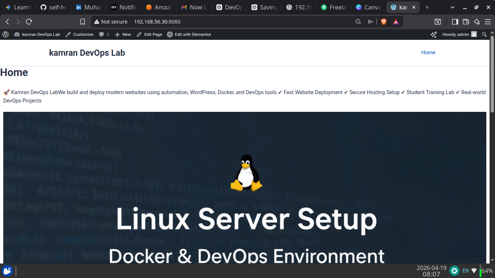
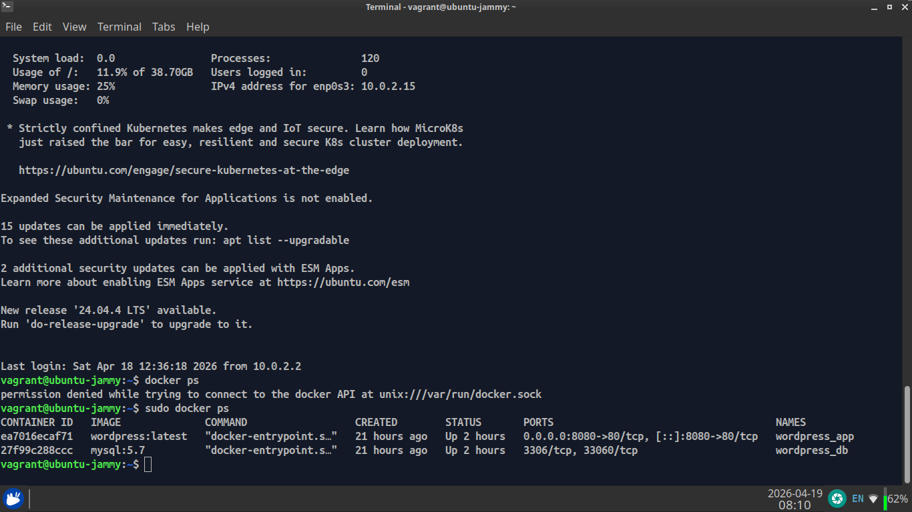

# 🚀 Self-Healing DevOps Infrastructure (Production-Style Lab)

## 👨‍💻 Author

**Muhammad Kamran Kabeer**
DevOps Engineer | Linux | Automation | Cloud Enthusiast

---

## 📌 Project Overview

This project demonstrates a **production-style self-healing infrastructure** using modern DevOps tools.

It simulates a real-world environment where services:

* 🔄 Automatically recover from failure
* ⚙️ Deploy consistently using Infrastructure as Code
* 📦 Run in isolated, containerized environments
* 📊 Are monitored using modern observability tools

---

## 🧠 Key Features

* 🔄 **Self-Healing Containers**
  Docker restart policies ensure automatic recovery

* ⚙️ **Infrastructure as Code (IaC)**
  Vagrant + Ansible automate full setup

* 📦 **Containerized Stack**
  WordPress + MySQL + Monitoring tools

* 📊 **Monitoring & Alerting**

  * Prometheus
  * Grafana
  * Alertmanager
  * Node Exporter
  * cAdvisor

* ⚡ **One Command Deployment**

```bash
vagrant up
```

---

## 🏗️ Architecture

```
Host Machine
   │
   ├── Vagrant (VM Provisioning)
   │       │
   │       └── Ubuntu VM (192.168.56.30)
   │               │
   │               ├── Ansible (Automation)
   │               │       ├── Install Docker
   │               │       ├── Configure System
   │               │       └── Deploy Containers
   │               │
   │               └── Docker (Container Runtime)
   │                       ├── WordPress
   │                       ├── MySQL
   │                       ├── Prometheus
   │                       ├── Grafana
   │                       ├── Alertmanager
   │                       ├── Node Exporter
   │                       └── cAdvisor
```

---

## ⚙️ Tech Stack

* Vagrant
* Ansible
* Docker
* Docker Compose
* Linux (Ubuntu)
* Prometheus
* Grafana
* Alertmanager

---

## 🚀 Getting Started

### 🔹 Prerequisites

* Vagrant
* VirtualBox
* Ansible

---

### 🔹 Setup

```bash
git clone https://github.com/muhammadkamrankabeer-oss/self-healing-docker.git
cd self-healing-docker
vagrant up
vagrant provision
```

---

## 🌐 Access Services

| Service      | URL                       |
| ------------ | ------------------------- |
| WordPress    | http://192.168.56.30:8080 |
| Prometheus   | http://192.168.56.30:9090 |
| Grafana      | http://192.168.56.30:3000 |
| Alertmanager | http://192.168.56.30:9093 |
| cAdvisor     | http://192.168.56.30:8081 |

---

## 🔄 Self-Healing Mechanism

This project uses Docker restart policies:

```yaml
restart: always
```

👉 If a container crashes → it restarts automatically
👉 Ensures **high availability without manual intervention**

---

## 📊 Monitoring Stack

* Prometheus → Metrics collection
* Grafana → Visualization dashboards
* Alertmanager → Alerts handling
* Node Exporter → System metrics
* cAdvisor → Container metrics

---

## 🧪 Use Cases

* DevOps learning labs
* Monitoring + alerting practice
* Infrastructure automation demos
* Interview-ready portfolio project

---

## 📸 Demo

### 🌐 WordPress Homepage



### 🐳 Running Containers



### ⚙️ Vagrant Environment


---

## 📂 Project Structure

```
ansible/        → Playbooks
docker/         → Docker configs
monitoring/     → Monitoring configs
scripts/        → Helper scripts
docs/           → Documentation
architecture/   → Diagrams
```

---

## 🔄 CI/CD (Coming Next)

This project is being upgraded with:

* GitHub Actions pipeline
* Automated validation
* Auto deployment

---

## 📜 License

This project is open-source and available for learning purposes.

---

## ⭐ Final Note

This is a **real-world DevOps practice project** demonstrating:

✔ Infrastructure as Code
✔ Containerization
✔ Monitoring & Alerting
✔ Self-Healing Systems

---

💡 *Built for learning, portfolio, and real DevOps growth.*
