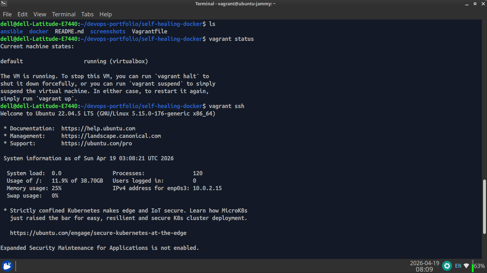

# 🚀 Self-Healing WordPress Infrastructure (DevOps Lab)

A hybrid DevOps project demonstrating automated infrastructure provisioning, configuration management, and containerized deployment of a WordPress application with self-healing capabilities.

---

## 📌 Project Overview

This project simulates a production-ready environment where a WordPress application is deployed using:

- **Vagrant** → Infrastructure provisioning  
- **Ansible** → Configuration management  
- **Docker** → Containerized application runtime  

The system is designed to automatically recover from failures, ensuring high availability and minimal manual intervention.

---

## 🧠 Key Features

- 🔄 **Self-Healing Containers**  
  Docker restart policies automatically recover failed services  

- ⚙️ **Infrastructure as Code (IaC)**  
  Fully automated setup using Vagrant + Ansible  

- 📦 **Containerized Deployment**  
  WordPress and MySQL running in isolated containers  

- ⚡ **One Command Setup**  
  Entire environment starts with:
  ```bash
  vagrant up

-----

  🧪 Lab + Real-World Use Case
Suitable for learning and small-scale production setups
🏗️ Architecture
Host Machine
   │
   ├── Vagrant (VM Provisioning)
   │       │
   │       └── Ubuntu VM (192.168.56.30)
   │               │
   │               ├── Ansible (Automation)
   │               │       ├── Install Docker
   │               │       ├── Configure system
   │               │       └── Deploy containers
   │               │
   │               └── Docker
   │                       ├── WordPress Container
   │                       └── MySQL Container

⚙️ Technologies Used
Vagrant
Ansible
Docker
Docker Compose
WordPress
MySQL
🚀 Getting Started
🔹 Prerequisites
Vagrant
VirtualBox
Ansible
🔹 Setup Instructions
git clone https://github.com/muhammadkamrankabeer-oss/self-healing-docker.git
cd self-healing-docker
vagrant up
🌐 Access Application

After setup:

http://192.168.56.30:8080
🔄 Self-Healing Mechanism

This project uses Docker restart policies:

restart: always

👉 If a container stops, it is automatically restarted.

💡 Use Cases
DevOps learning labs
Automated deployment demos
Small business hosting
Student training environments
👨‍💻 Author

Muhammad Kamran Kabeer
DevOps Enthusiast | Linux | Automation

📜 License

This project is open-source and available for learning and educational use.

## 📸 Demo

### 🌐 WordPress Homepage


### 🐳 Running Containers


### ⚙️ Vagrant Environment

